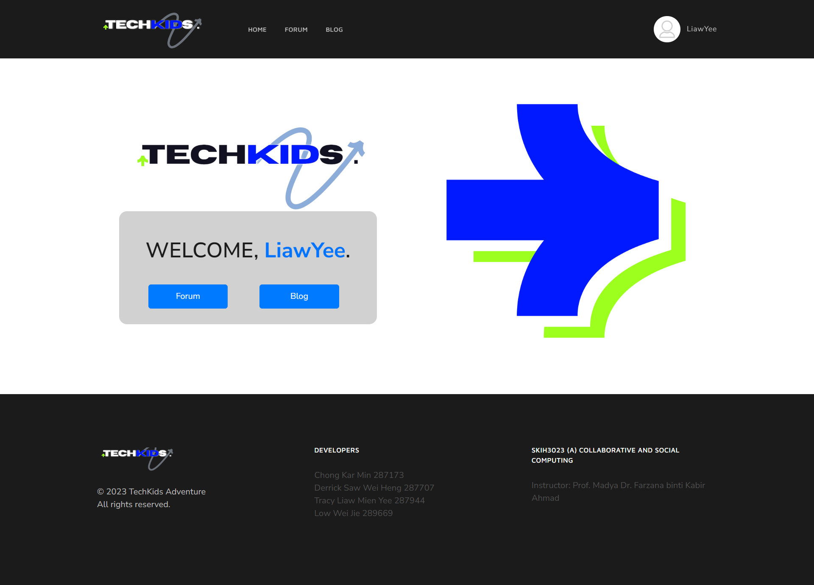

<h1 align="center"> TechKids Forum </h1>  

<h3 align="center">
  Community Forum allows users from around the world to connect, together discussing and sharing topics on Kids and Technologies.
</h3>

# Introduction
This project is developed in conjunction with the subject SKIH3023 Collaborative and Social Computing in our Semester 05.
In TechKids Forum, users can view all available forum topics and blog topics. However, further interaction will require users to create an account with us and log in to allow further interactions including viewing, voting, commenting, and searching forum blog topics. User Personalized Dashboard will also allow the users to have their accounts tailored to themselves.

# Features

**Functionality available:**

* Sign Up and Login
* Personalized Identity and Information
* View and interact with existing forum topics
* Create new forum topics
* View Blog topics
* View history activities

# Installation Process

**Installation Process (Windows)**

1. Go to the specific directory `cd Filename`
2. Create a Virtual Environment `python -m venv venv`
3. Activate Virtual Environment `.\venv\Scripts\activate`
4. Install Required Package `pip install -r requirements.txt`
5. Migrate Database `python manage.py migrate`
6. Run Project `python manage.py runserver`

# Project Demo

## TechKids Home Page

## Sign Up and Log In
### Sign Up
### Log In
## Forum Page
### Forum Main Page
### Forum Content Page
### Forum Add New Forum Page
### Forum Search Page

## Blog Page
### Blog Main Page
### Blog Content Page

## User Profile
## User Dashboard

### User Profile Page
